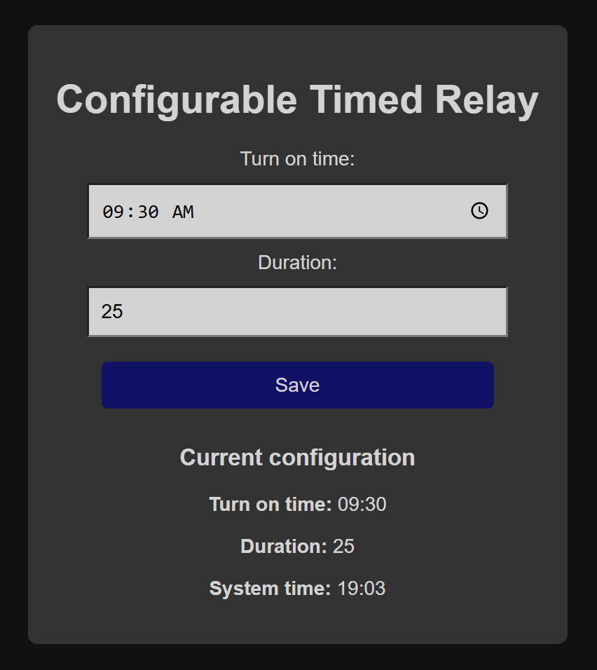
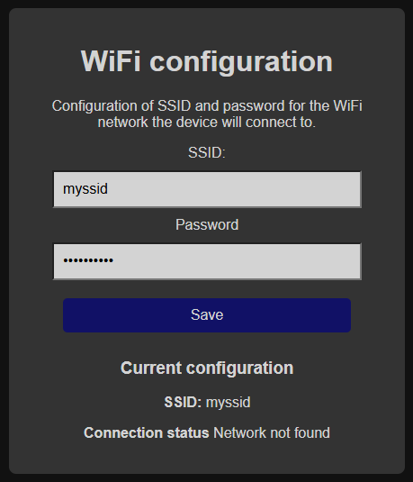
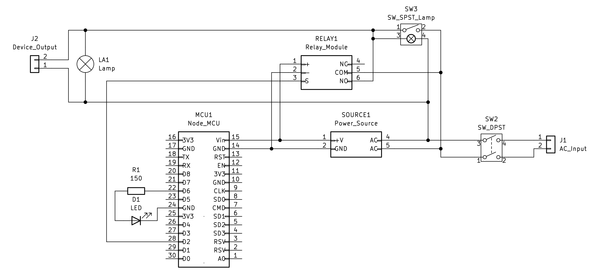
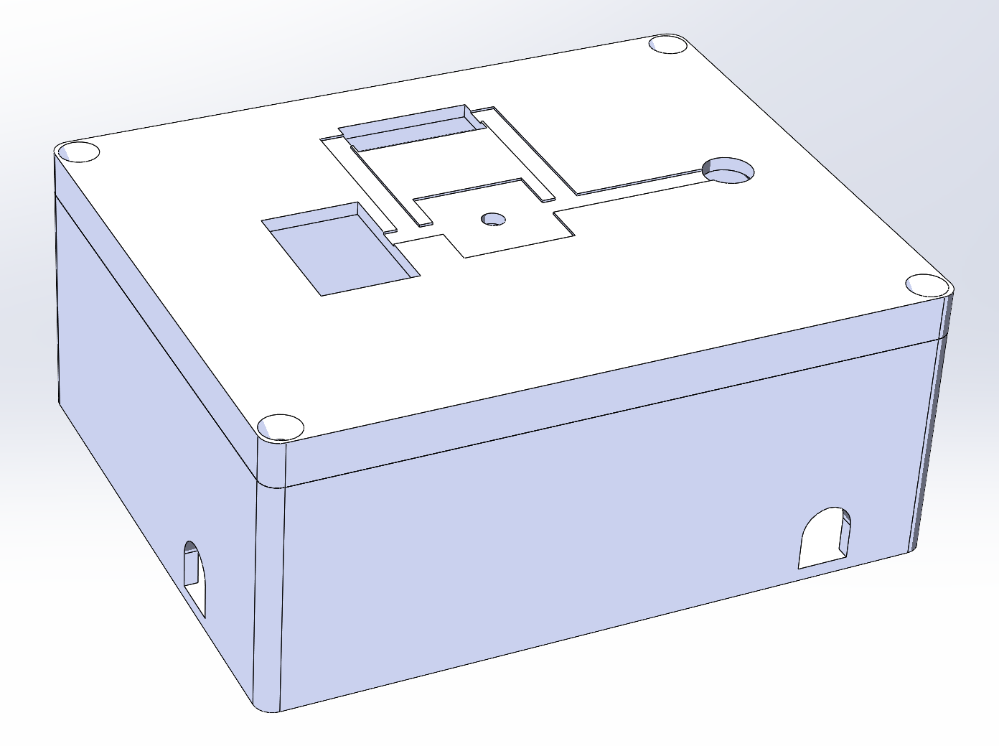

# configurable-timed-relay

### What is this

This project includes the firmware, circuit, and case design for a **system that powers AC electric appliances daily, at a user-defined fixed time and duration**. The user sets the schedule through a webpage served with an **ESP8266** based board, which is synchronized with the current time over internet and activates a relay module at the required hour to power the output. A 3D printed case allows a compact mounting of the involved components and wiring, along with lights to visually indicate the system status. A simple web portal allows the user to configure the WiFi where the device should connect to.

### Screenshots
#### Main page:

#### WiFi configuration page:

#### Circuit schematic:

#### Case 3D model:

